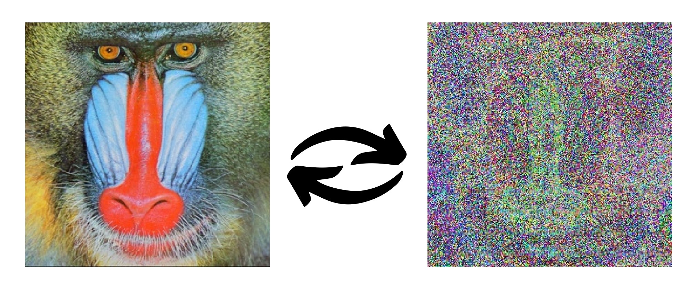

# Image Encryption and Decryption using S-Box (PYTHON)

This project demonstrates image encryption and decryption using an S-Box (Substitution Box) technique. The provided Python scripts use the OpenCV and NumPy libraries to process images.

## Requirements

- Python 3.x
- NumPy
- OpenCV

## Installation

1. Install Python 3.x from the official website: [Python.org](https://www.python.org/).
2. Install the required libraries using pip:

    ```sh
    pip install numpy opencv-python
    ```

## Usage

### Encryption

1. Place the image you want to encrypt in the same directory as the script. Ensure the image is named `baboon.jpg`.
2. Run the encryption script:

    ```sh
    python encrypt.py
    ```

3. The encrypted image will be displayed and saved as `encrypted.jpg` in the same directory.

### Decryption

1. Place the encrypted image (`baboon encrypted.bmp`) in the same directory as the script.
2. Run the decryption script:

    ```sh
    python decrypt.py
    ```

3. The decrypted image will be displayed and saved as `decrypted.jpg` in the same directory.

## Process Explanation

### Encryption

1. **Read and Resize Image**: The script reads the original image and resizes it to 256x256 pixels.
2. **Apply S-Box Substitution**: Each pixel in the image is processed using an S-Box (Substitution Box) array. The pixel value is split into its least significant bits (LSBs) and most significant bits (MSBs), which are then used as indices to look up a new value from the S-Box.
3. **Save and Display**: The encrypted image is saved to the disk and displayed.

### Decryption

1. **Read Encrypted Image**: The script reads the encrypted image from the disk.
2. **Apply Inverse S-Box Substitution**: Each pixel in the encrypted image is processed using an inverse S-Box array. The pixel value is split into its LSBs and MSBs, which are then used as indices to look up the original value from the inverse S-Box.
3. **Save and Display**: The decrypted image is saved to the disk and displayed.

By using S-Box and its inverse, the image encryption and decryption process ensures that each pixel value is substituted in a reversible manner, providing a simple yet effective encryption mechanism.


